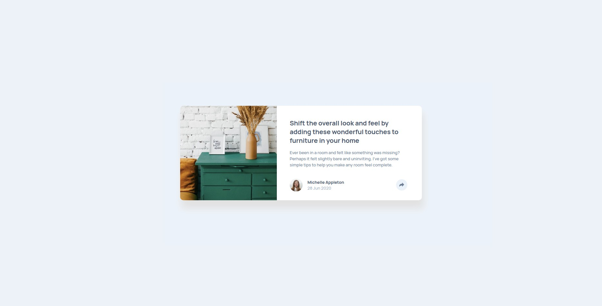

# Frontend Mentor - Article preview component solution

This is a solution to the [Article preview component challenge on Frontend Mentor](https://www.frontendmentor.io/challenges/article-preview-component-dYBN_pYFT).

## Overview

### The challenge

Users should be able to:

- View the optimal layout for the component depending on their device's screen size
- See the social media share links when they click the share icon

### Screenshot

### Links

- Solution URL: [GitHub](https://github.com/Adilsongb/article-preview-component)
- Live Site URL: [Vercel](https://article-preview-component-jet-phi.vercel.app/)

## My process

### Built with

- CSS custom properties
- Flexbox
- JavaScript
- Mobile-first workflow

## Author

- Frontend Mentor - [@Adilsongb](https://www.frontendmentor.io/profile/Adilsongb)
- Twitter - [@_adilsongb](https://twitter.com/_adilsongb)